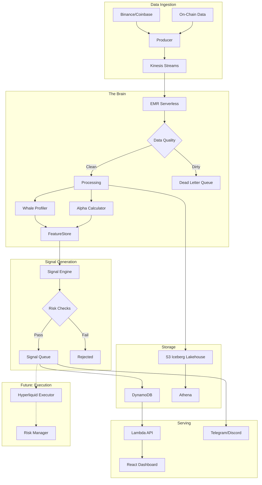

# 🐋 Coat Tail Capital

**Riding smart money so you don't have to think.**

> Real-time whale tracking, alpha scoring, and signal generation — built with PySpark Structured Streaming on AWS. A Principal Architect portfolio project demonstrating big data streaming, on-chain analytics, and AI-assisted development.

[](https://github.com/mv78/coattail-capital/actions)

---

## What Is This?

Coat Tail Capital is a real-time analytics platform that:

1. **Tracks whale wallets** — Ingests on-chain transfers and CEX trades
2. **Scores alpha** — Calculates which wallets consistently beat the market
3. **Generates signals** — Alerts when high-alpha wallets make moves
4. **Manages risk** — Position sizing, stop losses, circuit breakers
5. *(Future)* **Executes trades** — Hyperliquid perpetual futures

```
┌─────────────────────────────────────────────────────────────────────┐
│                                                                     │
│   "The best trade is someone else's research"                       │
│                                        — Ancient Degen Proverb      │
│                                                                     │
└─────────────────────────────────────────────────────────────────────┘
```

## Architecture



## Principal-Level Skills Demonstrated

| Capability | Implementation | Where |
|---|---|---|
| **PySpark Structured Streaming** | Windowed aggregations, watermarks, stateful processing | `src/spark-jobs/streaming/` |
| **Data Quality Engineering** | 10+ validation rules, DLQ routing, CloudWatch metrics | `src/spark-jobs/common/quality.py` |
| **Batch + Stream Processing** | Lambda architecture, historical backfill, reprocessing | `src/spark-jobs/batch/` |
| **Lakehouse Architecture** | Iceberg tables, schema evolution, time-travel queries | Glue Catalog + S3 |
| **Data Governance** | Lake Formation, LF-Tags, role-based access | `infra/modules/lake-formation/` |
| **Orchestration** | Step Functions, EventBridge scheduling | `infra/modules/step-functions/` |
| **Well-Architected Design** | All 6 pillars documented | `docs/WELL-ARCHITECTED.md` |
| **Architecture Decisions** | 6 ADRs with tradeoff analysis | `docs/ADR.md` |
| **AI-Assisted Development** | BMAD method, 6 agent specs | `agents/` |

## Quick Start

```bash
# Clone the repo
git clone git@github.com:mveksler/coattail-capital.git
cd coattail-capital

# Bootstrap Terraform state
./scripts/bootstrap-state.sh

# Deploy infrastructure (~5 min)
cd infra && terraform init && terraform apply

# Start the whale tracker
./scripts/start.sh

# Watch the money flow
open $(terraform output -raw dashboard_url)

# Stop tracking (save $$$)
./scripts/stop.sh
```

## Cost

| Mode | Cost | Notes |
|---|---|---|
| **Hunting** (streaming on) | ~$0.85/hr | EMR Serverless + Kinesis |
| **Sleeping** (streaming off) | <$0.01/day | Just S3 storage |
| **Hibernating** (destroyed) | $0.00 | `terraform destroy` |

Billing alarm auto-set at $25. We're not here to make AWS rich.

## Project Structure

```
coattail-capital/
├── docs/
│   ├── PRD.md                 # Product requirements
│   ├── ARCHITECTURE.md        # System design
│   ├── WELL-ARCHITECTED.md    # AWS WAF analysis
│   ├── ADR.md                 # Architecture decisions
│   └── RUNBOOK.md             # Weekend build guide
├── agents/                    # BMAD AI agent specs
│   ├── ba-agent.md
│   ├── architect-agent.md
│   ├── data-engineer-agent.md
│   ├── security-agent.md
│   ├── devops-agent.md
│   └── qa-agent.md
├── infra/                     # Terraform (9 modules)
│   ├── modules/
│   │   ├── kinesis/
│   │   ├── s3-lakehouse/
│   │   ├── emr-serverless/
│   │   ├── glue/
│   │   ├── iam/
│   │   ├── monitoring/
│   │   ├── step-functions/
│   │   └── lake-formation/
│   └── main.tf
├── src/
│   ├── producer/              # Kinesis producer (CEX + on-chain)
│   ├── spark-jobs/
│   │   ├── streaming/         # Real-time processing
│   │   ├── batch/             # Historical + reprocessing
│   │   └── common/            # Schemas, quality, writers
│   ├── api/                   # Lambda handlers
│   └── dashboard/             # React frontend
├── scripts/
│   ├── start.sh               # Start the tracker
│   ├── stop.sh                # Stop (save money)
│   └── bootstrap-state.sh     # Init Terraform state
└── .github/workflows/         # CI/CD
```

## Documentation

| Doc | What's In It |
|---|---|
| [PRD.md](docs/PRD.md) | Requirements, schemas, data quality framework |
| [ARCHITECTURE.md](docs/ARCHITECTURE.md) | Detailed system design |
| [WELL-ARCHITECTED.md](docs/WELL-ARCHITECTED.md) | AWS WAF pillar-by-pillar |
| [ADR.md](docs/ADR.md) | 6 architecture decision records |
| [RUNBOOK.md](docs/RUNBOOK.md) | Step-by-step weekend build guide |

## Development Method: BMAD

Built using **BMAD (Business-Manager-Architect-Developer)** agentic spec-driven development with Claude Code. Six AI agents, each with a specialty:

```
BA Agent ──▶ Architect Agent ──▶ Data Engineer Agent ──▶ DevOps Agent
                                        │
                                        ▼
                              Security Agent ◀── QA Agent
```

Every spec was human-reviewed before implementation. See [`agents/`](agents/) for the prompts.

## Roadmap

- [x] **Phase 0:** CEX data ingestion + anomaly detection
- [x] **Phase 1:** Data quality framework + batch processing
- [ ] **Phase 2:** On-chain whale tracking + alpha scoring
- [ ] **Phase 3:** Signal generation + notifications
- [ ] **Phase 4:** Paper trading simulation
- [ ] **Phase 5:** Live execution (Hyperliquid perps)

## Disclaimer

```
┌─────────────────────────────────────────────────────────────────────┐
│                                                                     │
│   This is a PORTFOLIO PROJECT for educational purposes.             │
│                                                                     │
│   • Not financial advice                                            │
│   • Not a recommendation to trade                                   │
│   • Past whale performance ≠ future results                         │
│   • You will probably lose money if you trade based on this         │
│   • We are not responsible for your degen decisions                 │
│                                                                     │
│   DYOR. NFA. WAGMI (maybe). HFSP (probably).                        │
│                                                                     │
└─────────────────────────────────────────────────────────────────────┘
```

## Contributors

**Mike Veksler** — Principal Architect, PySpark Lead  
[](https://www.linkedin.com/in/mikeveksler-798b7913)

**Frank D'Avanzo** — Engineering Manager, BMAD Coach  
[](https://github.com/TheFrankBuilder)

---

*"In a market full of noise, follow the signal."* 🐋
