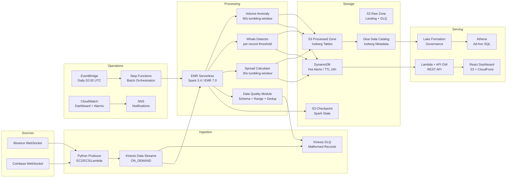

# Architecture Document: Coat Tail Capital

> "Riding smart money so you don't have to think"

## Document Control

| Field | Value |
|---|---|
| **Project** | Coat Tail Capital (CTC) |
| **Version** | 1.0 |
| **Authors** | Mike Veksler (Principal Architect), Frank D'Avanzo (Head of Agentic AI & Strategic Fly-Bys, BMAD-Method Coach) |
| **Source PRD** | `docs/PRD.md` v1.0 |
| **ADRs** | `docs/ADR.md` (ADR-001 through ADR-006) |
| **Region** | us-west-2 (single region) |
| **Environment** | dev (single account) |

---

## 1. Architecture Overview

### 1.1 High-Level Data Flow



### 1.2 ASCII Data Flow (Whiteboard Version)

```
[Binance WS] ──┐
                ├──→ [Python Producer] ──→ [Kinesis ON_DEMAND] ──→ [EMR Serverless - PySpark 3.4]
[Coinbase WS] ─┘                              │                          │
                                          [Kinesis DLQ]     ┌────────────┼────────────┐
                                                            ▼            ▼            ▼
                                                      [Volume      [Whale       [Spread
                                                       Anomaly]     Detector]    Calculator]
                                                            │            │            │
                                                            ▼            ▼            ▼
                                               ┌──── [Data Quality Module] ────┐
                                               │                              │
                                          pass │                         fail │
                                               ▼                              ▼
                                    ┌──────────┴──────────┐            [S3 DLQ Zone]
                                    │                     │
                              [S3 Iceberg]          [DynamoDB]
                              via Glue Catalog      Hot Alerts (24h TTL)
                                    │                     │
                              [Lake Formation]      [Lambda + API GW]
                                    │                     │
                              [Athena SQL]          [React Dashboard]
```

---

## 2. Service Inventory

| Service | Role | Resource Name | ADR | Justification |
|---|---|---|---|---|
| **Kinesis Data Streams** | Stream ingestion | `coattail-trades` | ADR-001 | ON_DEMAND, no shard management, 10-60x cheaper than MSK at our scale |
| **Kinesis DLQ** | Dead letter queue | `{prefix}-trades-dlq` | — | 48h retention for malformed record investigation |
| **EMR Serverless** | Spark compute | `{prefix}-spark` (EMR 7.0) | ADR-003 | Pay-per-second, Spark 3.4, zero idle cost, full PySpark control |
| **S3** | Lakehouse storage | 4 buckets: raw, processed, checkpoint, athena | — | Tiered lifecycle, AES256 encryption, versioning on processed |
| **Apache Iceberg** | Table format | Via Glue Catalog | ADR-002 | ACID, time-travel, schema/partition evolution, AWS-native |
| **Glue Data Catalog** | Metadata | `{prefix}_lakehouse` | — | Central schema registry, Iceberg catalog, Athena integration |
| **DynamoDB** | Hot alert store | `{prefix}-alerts` | — | PAY_PER_REQUEST, TTL 24h, SSE enabled, 2 GSIs |
| **Lambda** | API compute | 3 batch functions + API handler | — | Pay-per-invocation, zero idle cost |
| **API Gateway** | REST API | — | — | Throttling, caching, CORS |
| **Step Functions** | Batch orchestration | `{prefix}-batch-workflow` | ADR-004 | Zero idle cost, visual workflow, native EMR integration |
| **EventBridge** | Scheduling | Daily 02:00 UTC (disabled default) | ADR-004 | Serverless cron, no minimum cost |
| **Lake Formation** | Data governance | Hybrid IAM + LF mode | ADR-005 | Database/table permissions, LF-Tags, analyst role |
| **CloudWatch** | Monitoring | Dashboard + 3 alarms | — | Native integration, billing alarm at $25 |
| **SNS** | Notifications | `{prefix}-alarms` | — | Alarm delivery, Step Functions failure alerts |
| **SSM Parameter Store** | Configuration | 6 parameters | — | No secrets in code, service discovery |

---

## 3. Data Schemas

### 3.1 Ingestion: Unified Trade Event (Kinesis Payload)

```json
{
  "event_id": "uuid",
  "exchange": "binance|coinbase",
  "symbol": "BTC-USDT",
  "price": 67432.50,
  "quantity": 0.5,
  "quote_volume": 33716.25,
  "side": "buy|sell",
  "timestamp": "2025-02-05T10:30:00.123Z",
  "ingestion_timestamp": "2025-02-05T10:30:00.456Z"
}
```

### 3.2 Processing: PySpark Schemas

**Volume Aggregation (60s Window)**

| Column | Type | Description |
|---|---|---|
| `symbol` | STRING | Trading pair (e.g., BTC-USDT) |
| `exchange` | STRING | Source exchange |
| `window_start` | TIMESTAMP | Window start time |
| `window_end` | TIMESTAMP | Window end time |
| `trade_count` | LONG | Number of trades in window |
| `total_volume` | DOUBLE | Sum of quote_volume |
| `avg_price` | DOUBLE | VWAP for window |
| `max_price` | DOUBLE | Highest trade price |
| `min_price` | DOUBLE | Lowest trade price |
| `buy_volume` | DOUBLE | Volume from buy-side |
| `sell_volume` | DOUBLE | Volume from sell-side |

**Anomaly Alert Record**

| Column | Type | Description |
|---|---|---|
| `alert_id` | STRING | UUID |
| `alert_type` | STRING | `volume_spike \| whale \| spread` |
| `symbol` | STRING | Trading pair |
| `exchange` | STRING | Source exchange |
| `severity` | STRING | `low \| medium \| high` |
| `z_score` | DOUBLE | For volume anomalies |
| `threshold_value` | DOUBLE | Threshold that was exceeded |
| `actual_value` | DOUBLE | Observed value |
| `window_start` | TIMESTAMP | Detection window start |
| `detected_at` | TIMESTAMP | Alert generation time |
| `message` | STRING | Human-readable alert text |
| `ttl_epoch` | LONG | DynamoDB TTL (detected_at + 24h) |

### 3.3 Storage: Iceberg Tables

| Table | Partition Strategy | Location |
|---|---|---|
| `raw_trades` | `date(timestamp), symbol` | `s3://processed/raw_trades/` |
| `volume_aggregates` | `date(window_start), symbol` | `s3://processed/volume_aggregates/` |
| `anomaly_alerts` | `date(detected_at), alert_type` | `s3://processed/anomaly_alerts/` |
| `whale_trades` | `date(detected_at), symbol` | `s3://processed/whale_trades/` |
| `exchange_spreads` | `date(window_start), symbol` | `s3://processed/exchange_spreads/` |

All tables use Iceberg hidden partitioning — queries filter on timestamp without knowing partition structure.

### 3.4 DynamoDB: Alerts Table Design

| Attribute | Type | Role |
|---|---|---|
| `alert_id` | S | Partition key |
| `detected_at` | S | Sort key (ISO timestamp) |
| `alert_type` | S | GSI-1 partition key |
| `symbol` | S | GSI-2 partition key |
| `ttl_epoch` | N | TTL attribute (24h auto-expiry) |

**Global Secondary Indexes:**

| GSI | Hash Key | Range Key | Purpose |
|---|---|---|---|
| `type-time-index` | `alert_type` | `detected_at` | GET /alerts?type=whale |
| `symbol-time-index` | `symbol` | `detected_at` | GET /alerts?symbol=BTC-USDT |

---

## 4. Streaming Architecture

### 4.1 PySpark Job: Volume Anomaly Detection

**Input:** Kinesis stream `coattail-trades` (unified trade events)
**Window:** 60-second tumbling window
**Watermark:** 30 seconds (tolerate late data up to 30s)
**Checkpoint:** S3 every 60 seconds

**Processing Logic:**
1. Deserialize JSON from Kinesis `data` column
2. Run through Data Quality Module (schema + null + range validation)
3. Aggregate volume per `(symbol, exchange)` per 60s window
4. Maintain rolling 1-hour mean and stddev per symbol (stateful)
5. Calculate z-score: `z = (window_volume - rolling_mean) / rolling_stddev`
6. Flag anomaly if `|z| > 2.5` (severity: `>2.5` medium, `>3.5` high)

**Output Sinks:**
- Anomaly records → DynamoDB (hot alerts) + S3 Iceberg `anomaly_alerts`
- All volume aggregates → S3 Iceberg `volume_aggregates`

### 4.2 PySpark Job: Whale Detection

**Input:** Kinesis stream (unified trade events)
**Processing:** Per-record, no windowing
**Threshold:** `quote_volume > $100,000`

**Processing Logic:**
1. Deserialize and validate through Data Quality Module
2. Filter trades where `quote_volume > 100000`
3. Enrich with severity: `>$100K` medium, `>$500K` high, `>$1M` critical
4. Write alert with full trade context

**Output Sinks:**
- Whale alerts → DynamoDB + S3 Iceberg `whale_trades`

### 4.3 PySpark Job: Cross-Exchange Spread

**Input:** Kinesis stream (trades from both Binance and Coinbase)
**Window:** 30-second tumbling window
**Watermark:** 15 seconds

**Processing Logic:**
1. Deserialize and validate through Data Quality Module
2. Calculate VWAP per `(symbol, exchange)` per 30s window
3. Join Binance VWAP with Coinbase VWAP on `(symbol, window)`
4. Spread = `(binance_vwap - coinbase_vwap) / coinbase_vwap * 100`
5. Flag if `|spread| > 0.5%`

**Output Sinks:**
- Spread records → DynamoDB + S3 Iceberg `exchange_spreads`

### 4.4 Data Quality Module (`src/spark-jobs/common/quality.py`)

Shared module consumed by all three streaming jobs.

**Validation Pipeline:**
```
Raw Record → Schema Validation → Null Checks → Range Validation → Deduplication → Timeliness Check → Valid Record
                  │ fail              │ fail          │ fail             │ dup              │ late
                  ▼                   ▼               ▼                 ▼                  ▼
            [DLQ: malformed]  [DLQ: incomplete]  [DLQ: invalid]   [Dropped, logged]  [Flagged, processed]
```

**Rules:**
| Dimension | Rule | Action |
|---|---|---|
| Completeness | Required fields not null: `event_id`, `symbol`, `price`, `quantity`, `timestamp` | Route to DLQ |
| Validity | `price > 0`, `quantity > 0`, `symbol` in allowed list | Route to DLQ |
| Timeliness | `timestamp` within 5 minutes of processing time | Flag as late, still process |
| Consistency | `quote_volume ≈ price × quantity` (±0.1% tolerance) | Log warning, still process |
| Uniqueness | No duplicate `event_id` within 1-hour window | Deduplicate, keep first |

**CloudWatch Metrics Published:**
- `RecordsProcessed`, `RecordsPassed`, `RecordsFailed`, `RecordsLate`, `RecordsDuplicate`
- `QualityScore` = `RecordsPassed / RecordsProcessed × 100`
- Alarm: `QualityScore < 95%` for 5 minutes

### 4.5 Checkpointing & Fault Tolerance

| Setting | Value | Rationale |
|---|---|---|
| Checkpoint location | `s3://{prefix}-checkpoint/` | Durable, survives job restarts |
| Checkpoint interval | 60 seconds | Balances latency vs. S3 write cost |
| Starting position | `TRIM_HORIZON` | Recovers from last checkpoint on restart |
| Output mode | Append (aggregates), Update (rolling stats) | Appropriate for each sink type |
| Watermark | 30s (volume), 15s (spread) | Tolerates network jitter without excessive latency |
| S3 checkpoint expiry | 7 days | Prevents stale checkpoint accumulation |

---

## 5. Batch Architecture

### 5.1 Step Functions Workflow


**Schedule:** Daily 02:00 UTC (disabled by default — enable for demo)

### 5.2 Historical Loader

**Purpose:** Backfill historical trade data from Binance REST API
**API:** `GET /api/v3/aggTrades` with time range pagination (max 1000/request)
**Output:** S3 raw zone as Parquet, partitioned by `date` and `symbol`

### 5.3 Reprocessing

**Purpose:** Recompute anomalies after algorithm changes using Iceberg time-travel
**Input:** `raw_trades` table at specific snapshot or time range
**Output:** `anomalies_reprocessed` table for comparison and optional swap

```sql
-- Read data as of a specific snapshot
SELECT * FROM glue_catalog.coattail_dev_lakehouse.raw_trades
VERSION AS OF 123456789;

-- Read data as of a specific timestamp
SELECT * FROM glue_catalog.coattail_dev_lakehouse.raw_trades
TIMESTAMP AS OF '2025-02-01 00:00:00';
```

---

## 6. IAM Role Inventory

| Role | Trust Policy | Key Permissions | Principle of Least Privilege |
|---|---|---|---|
| **EMR Execution** | `emr-serverless.amazonaws.com` | S3 read/write (3 specific buckets), Kinesis read (1 stream), DynamoDB write (1 table), Glue catalog (1 database), CloudWatch metrics/logs | Scoped to specific ARNs, CloudWatch conditioned on `CryptoPulse` namespace |
| **Producer** | `ec2.amazonaws.com`, `ecs-tasks.amazonaws.com`, `lambda.amazonaws.com` | Kinesis `PutRecord`, `PutRecords`, `DescribeStream` (1 stream only) | Write-only to specific stream ARN |
| **Lambda API** | `lambda.amazonaws.com` | DynamoDB `GetItem`, `Query`, `Scan` (1 table + GSIs), CloudWatch basic execution | Read-only on specific table ARN |
| **Step Functions** | `states.amazonaws.com` | EMR Serverless `StartJobRun`, `GetJobRun`, Lambda invoke (3 functions), SNS publish, CloudWatch metrics | Scoped to specific function and application ARNs |
| **Analyst** | `iam.amazonaws.com` (MFA required) | Athena `StartQueryExecution`, Glue `GetTable/GetDatabase`, S3 read (processed + athena), Lake Formation `GetDataAccess` | Read-only, MFA enforced, no write access |

---

## 7. Network Architecture

**Decision: No VPC for serverless-first design.**

All services are serverless and communicate via AWS service endpoints:
- Kinesis, S3, DynamoDB, Glue, CloudWatch — all have public endpoints
- EMR Serverless — runs in AWS-managed VPC, no customer VPC needed
- Lambda — runs in AWS-managed network
- API Gateway — public endpoint with throttling

**Encryption:**
- At rest: AES256 (S3 bucket key), KMS (Kinesis), SSE (DynamoDB)
- In transit: TLS for all AWS API calls, WSS for exchange WebSocket connections

**Justification:** A customer VPC would add NAT Gateway costs (~$32/month) and PrivateLink endpoint costs with no security benefit for this architecture — all data is public market data, all storage is encrypted, and IAM provides access control. For enterprise deployments, a VPC with VPC endpoints would be recommended for compliance.

---

## 8. Monitoring Strategy

### 8.1 CloudWatch Dashboard Widgets

| Widget | Type | Metric | Purpose |
|---|---|---|---|
| Kinesis Incoming Records | Line chart | `IncomingRecords` | Verify data flowing |
| Kinesis Iterator Age | Line chart | `GetRecords.IteratorAgeMilliseconds` | Detect consumer lag |
| DynamoDB Write Capacity | Line chart | `ConsumedWriteCapacityUnits` | Alert activity monitor |
| Estimated Charges | Number | `EstimatedCharges` | Cost monitoring |
| Anomaly Alerts | Custom | `CryptoPulse/Alerts` | Alert volume tracking |

### 8.2 Alarms

| Alarm | Threshold | Evaluation | Action |
|---|---|---|---|
| Billing | > $25 | 1 of 1 periods (6h) | SNS notification |
| Kinesis Iterator Age | > 300,000 ms (5 min) | 3 of 3 periods (5 min) | SNS notification |
| DynamoDB Throttle | > 5 events | 2 of 2 periods (5 min) | SNS notification |
| Quality Score | < 95% | 5 minutes sustained | SNS notification |

### 8.3 Operational Metrics (Custom)

| Metric | Namespace | Published By |
|---|---|---|
| `RecordsProcessed` | `CryptoPulse/Quality` | Data Quality Module |
| `RecordsPassed` | `CryptoPulse/Quality` | Data Quality Module |
| `RecordsFailed` | `CryptoPulse/Quality` | Data Quality Module |
| `QualityScore` | `CryptoPulse/Quality` | Data Quality Module |
| `AnomalyCount` | `CryptoPulse/Alerts` | Streaming jobs |
| `WhaleCount` | `CryptoPulse/Alerts` | Whale detector |
| `SpreadAlertCount` | `CryptoPulse/Alerts` | Spread calculator |
| `BatchJobSuccess` | `CryptoPulse/Batch` | Step Functions |
| `BatchJobFailure` | `CryptoPulse/Batch` | Step Functions |

---

## 9. API Design

### 9.1 GET /alerts

**Query Parameters:**
| Param | Required | Default | Description |
|---|---|---|---|
| `type` | No | all | `volume_spike \| whale \| spread` |
| `symbol` | No | all | e.g., `BTC-USDT` |
| `limit` | No | 50 | max 200 |
| `since` | No | 24h ago | ISO timestamp |

**DynamoDB Access Pattern:**
- No filter → Scan with `limit` (acceptable for low-volume table with TTL)
- By type → Query `type-time-index` GSI
- By symbol → Query `symbol-time-index` GSI
- By type + since → Query GSI with `detected_at > since` range condition

### 9.2 GET /metrics/{symbol}

**Response:** Aggregated current state for a symbol (latest volume window, latest spread, anomaly count, last whale).

**DynamoDB Access Pattern:** Query both GSIs filtered by symbol, aggregate in Lambda.

---

## 10. Cost Architecture

### 10.1 Active Demo Mode

| Service | Config | Est. Cost/Hour |
|---|---|---|
| Kinesis (ON_DEMAND, ~1K rec/s) | 1 shard equivalent | ~$0.50 |
| EMR Serverless (2 vCPU, 4GB) | Spark 3.4 | ~$0.30 |
| DynamoDB (PAY_PER_REQUEST) | Low write volume | ~$0.01 |
| Lambda (low invocation) | 128-512 MB | ~$0.01 |
| **Total active** | | **~$0.82/hour** |

### 10.2 Idle Mode

| Service | Cost/Day |
|---|---|
| S3 storage (< 1GB) | < $0.01 |
| Everything else | $0.00 (serverless, scale-to-zero) |
| **Total idle** | **< $0.01/day** |

### 10.3 Cost Safety Controls

| Control | Mechanism | Threshold |
|---|---|---|
| Billing alarm | CloudWatch | $25 |
| EMR auto-stop | Auto-stop idle timeout | 15 minutes |
| DynamoDB TTL | Auto-purge old alerts | 24 hours |
| S3 lifecycle | Transition → IA → Delete | 30d → 90d |
| Checkpoint expiry | S3 lifecycle | 7 days |
| Athena results expiry | S3 lifecycle | 7 days |
| Start/Stop scripts | `scripts/start.sh`, `scripts/stop.sh` | Manual |

---

## 11. Schema Evolution Strategy

Iceberg supports schema evolution without table rewrites:

```sql
-- Add a new column (instant metadata operation, no Parquet rewrite)
ALTER TABLE glue_catalog.coattail_dev_lakehouse.volume_aggregates
ADD COLUMN market_cap_rank INT;

-- Old data returns NULL for the new column
-- New data populates the field
-- Existing Parquet files are untouched
```

**Partition Evolution:** Iceberg allows changing partition schemes (e.g., from daily to hourly) without rewriting data. New data uses the new scheme; old data stays in place.

---

## 12. Deployment Architecture

### 12.1 Infrastructure (Terraform)

```
infra/
├── main.tf              # Root composition: 8 modules + DynamoDB + SSM
├── variables.tf         # 12 input variables with sensible defaults
├── outputs.tf           # 13 outputs for service discovery
├── providers.tf         # AWS provider config
├── backend.tf           # S3 remote state + DynamoDB locking
└── modules/
    ├── kinesis/          # Trade stream + DLQ
    ├── s3-lakehouse/     # 4 buckets with lifecycle policies
    ├── emr-serverless/   # Spark 3.4 application
    ├── glue/             # Data catalog database
    ├── iam/              # 3 roles with least-privilege policies
    ├── monitoring/       # Dashboard + 3 alarms + SNS
    ├── step-functions/   # 9-state batch workflow + 3 Lambdas + EventBridge
    └── lake-formation/   # Governance: permissions + LF-Tags + analyst role
```

### 12.2 Deployment Sequence

```bash
# 1. Bootstrap remote state
./scripts/bootstrap-state.sh

# 2. Deploy all infrastructure
cd infra && terraform init && terraform plan -out=plan.tfplan && terraform apply plan.tfplan

# 3. Verify outputs
terraform output

# 4. Start streaming
./scripts/start.sh

# 5. Stop when done
./scripts/stop.sh
```

### 12.3 CI/CD (GitHub Actions)

| Job | Trigger | Steps |
|---|---|---|
| `lint-and-test` | Push/PR to main | Python lint (ruff), type check (mypy), unit tests (pytest) |
| `terraform-validate` | Push/PR to main | `terraform fmt -check`, `terraform init -backend=false`, `terraform validate` |
| `security-scan` | Push/PR to main | tfsec, checkov — blocking on failure |

---

## Appendix A: Alternatives Not Chosen

| Component | Chosen | Rejected | Why |
|---|---|---|---|
| Stream broker | Kinesis | MSK Serverless, MSK Provisioned | 10-60x cheaper, simpler (ADR-001) |
| Table format | Iceberg | Delta Lake, Hudi | AWS-native Glue support, partition evolution (ADR-002) |
| Compute | EMR Serverless | Glue Streaming, EKS | Full PySpark control, portfolio differentiation (ADR-003) |
| Orchestration | Step Functions | MWAA (Airflow), EventBridge-only | Zero idle cost, visual workflow (ADR-004) |
| Governance | Lake Formation | IAM-only | Principal-level demonstration, future column security (ADR-005) |
| Data quality | Custom PySpark | Great Expectations, Deequ | Streaming-native, lightweight, demonstrates fundamentals (ADR-006) |
| Dashboard | React + S3 | Grafana, QuickSight | Custom portfolio piece, no server cost |
| Alert store | DynamoDB | RDS, ElastiCache | Serverless pricing, TTL cleanup, schema flexibility |
| IaC | Terraform | CDK, CloudFormation | Multi-cloud portable, state management |

---

## Appendix B: Production Recommendations

For enterprise deployments beyond this portfolio project:

| Area | Portfolio Choice | Production Recommendation |
|---|---|---|
| Streaming | Kinesis ON_DEMAND | MSK Serverless for Kafka ecosystem clients |
| Networking | No VPC | VPC + VPC Endpoints + PrivateLink |
| DynamoDB | PITR disabled | PITR enabled, cross-region backup |
| Security scans | Blocking in CI | Blocking + pre-commit hooks + SAST |
| Monitoring | CloudWatch | CloudWatch + PagerDuty/OpsGenie integration |
| Multi-region | Single region | Active-passive with S3 replication |
| Auth | None (public API) | Cognito + API key + WAF |
| Data quality | Custom module | Great Expectations or Glue Data Quality |
| Schema registry | Glue Catalog only | Confluent Schema Registry (if MSK) |
